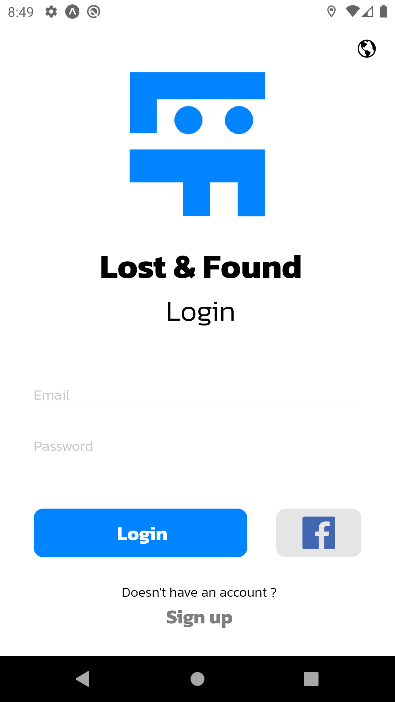
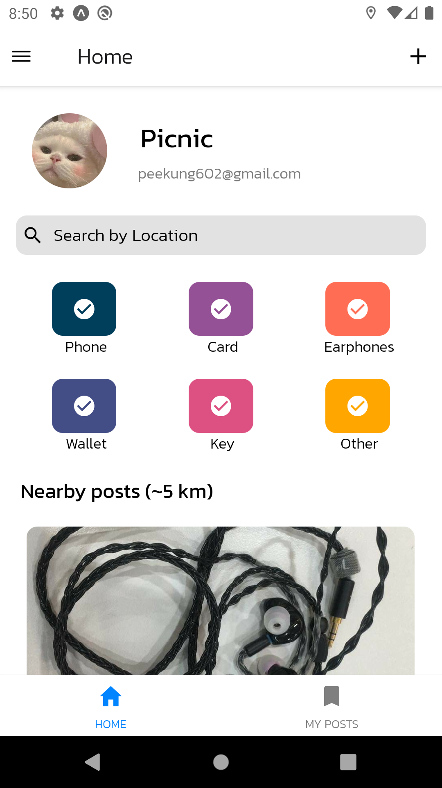
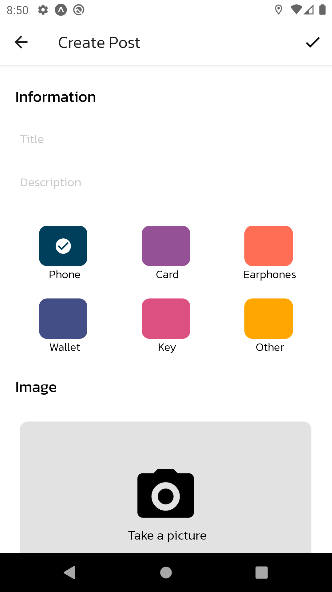
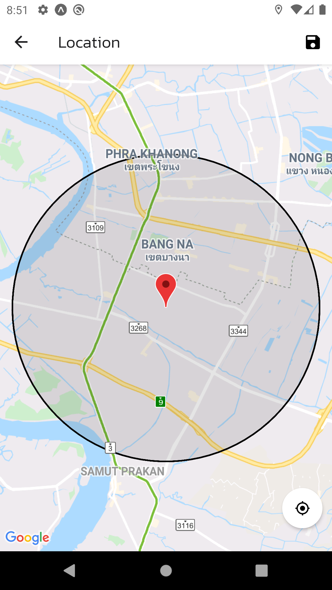
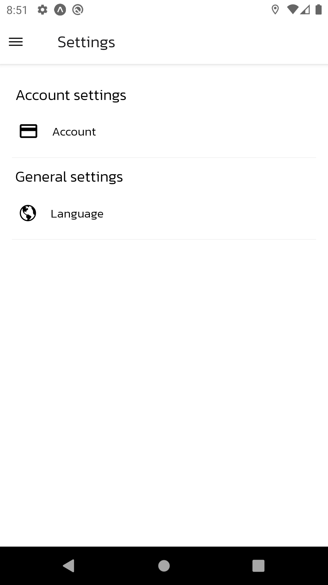

# Lost and found App :iphone:

- Lost and found App made with React Native


## Firebase setup 🔥

1) Create .env file for firebase API_KEY

```
API_KEY=xxxxxxxxxxxxxxxxxxxxxxxx
```

2) Add "categories" collection to cloud firestore with 6 document having field like this

```
{
  color: STRING,
  title: {
    en: STRING,
    th: STRING
  }
}
```

## Screenshots :camera:

<div> </div>
<div> </div>
<div> </div>
