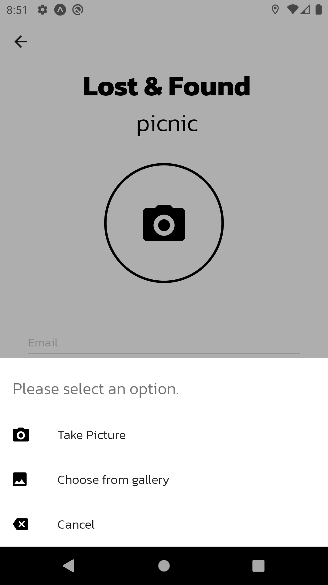

# Lost and found App :iphone:

- Lost and found App made with React Native

## Firebase setup 🔥

1) Replace your firebase API_KEY in env.js file

2) Add "categories" collection to cloud firestore with 6 document having field like this

```
{
  color: STRING,
  title: {
    en: STRING,
    th: STRING
  }
}
```

## Screenshots :camera:

<div> </div>
<div> </div>
<div> </div>
